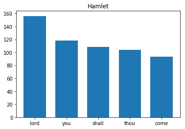
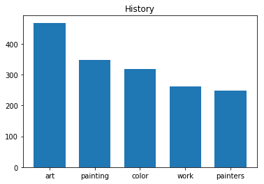
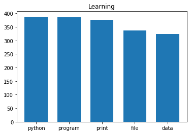
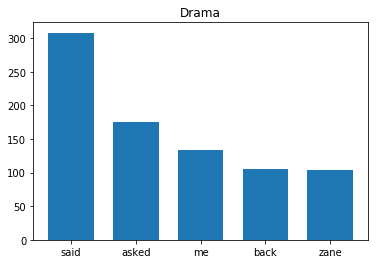
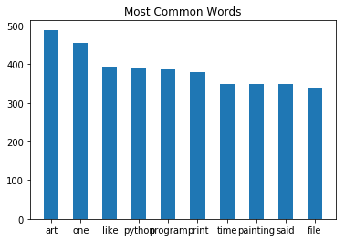
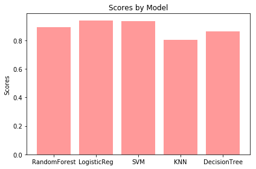
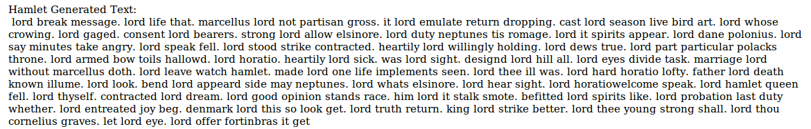
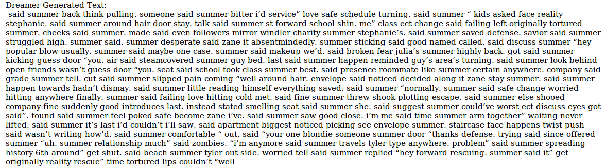
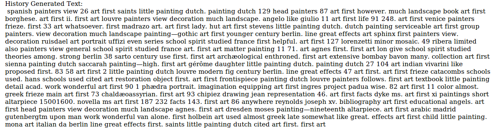
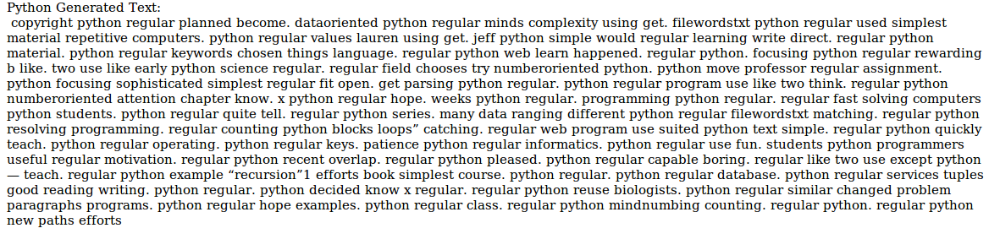

# Project
Machine Learning Using Books


# Data Minning - Creating a books dataset
## Download 4 different books from the internet:


```python
import urllib
#download the data from the internet
#urllib.urlretrieve("http://m.uploadedit.com/ba3s/1497949797668.txt", "data\Hamlet.txt")
#urllib.urlretrieve("http://m.uploadedit.com/ba3s/1497950282570.txt", "data\History.txt")
#urllib.urlretrieve("http://m.uploadedit.com/ba3s/1497950367764.txt", "data\Python.txt")
#urllib.urlretrieve("http://m.uploadedit.com/ba3s/1497950434984.txt", "data\Dreamer.txt")
```

### Hamlet - Tragedy written by William Shakespeare
### History of Painting - Text-Book by John Charles Van Dyke
### Python for Informatics Exploring Information - Programming book by Charles Severance
### The Dreamer - Drama, Fantasy book by J.M.Hurley


```python
import pandas as pd
import string
from nltk.corpus import stopwords
import nltk
import matplotlib.pyplot as plt
import numpy as np
#read the text books int data frames
df_Hamlet = pd.read_csv('/home/amir/PycharmProjects/Project/data/Hamlet.txt', sep="\n", header = None, error_bad_lines=False)
df_History = pd.read_csv('/home/amir/PycharmProjects/Project/data/History.txt', sep="\n", header = None, error_bad_lines=False)
df_Python = pd.read_csv('/home/amir/PycharmProjects/Project/data/Python.txt', sep="\n", header = None, error_bad_lines=False)
df_Dreamer = pd.read_csv('/home/amir/PycharmProjects/Project/data/Dreamer.txt', sep="\n", header = None, error_bad_lines=False)
#add to each data frame his own book value
df_Hamlet[1] = 'Hamlet'
df_History[1] = 'History Book'
df_Python[1] = 'Learning Book'
df_Dreamer[1] = 'Drama Book'
#concat the dataframes into one
df = pd.concat([df_Hamlet, df_History, df_Python, df_Dreamer])
#remove punctuation marks


def remove_punctuation(s):
    s = ''.join([i for i in s if i not in frozenset(string.punctuation)])
    return s
#we want our model to predict based on given sentence so we drop any line with less then 3 words


def remove_short(s):
    if len(s.split(' ')) > 2:
        return s
    else:
        return ''

#lower the text for more general form
df[0] = df[0].str.lower()

#remove any english stop word
stop = set(stopwords.words('english'))
df[0] = df[0].apply(lambda x: ' '.join([word for word in x.split() if word not in stop]))
df[0] = df[0].apply(remove_punctuation)
df[0] = df[0].apply(remove_short)
#remove empty columns
df = df[df[0] != '']
```

Now that our data is clean and more relevant we spilt the dataframe back based on the book


```python
df_Hamlet = df[df[1] == 'Hamlet']
df_Python = df[df[1] == 'Learning Book']
df_History = df[df[1] == 'History Book']
df_Dreamer = df[df[1] == 'Drama Book']
```

Now let's take a look into the 5 most common words in each book


```python
Hamlet_words = pd.Series(' '.join(df_Hamlet[0]).split()).value_counts()[:5]
History_words = pd.Series(' '.join(df_History[0]).split()).value_counts()[:5]
Python_words = pd.Series(' '.join(df_Python[0]).split()).value_counts()[:5]
Dreamer_words = pd.Series(' '.join(df_Dreamer[0]).split()).value_counts()[:5]
#Plot histogram using matplotlib bar()
indexes = np.arange(5)
width = 0.7
plt.bar(indexes, Hamlet_words, width)
plt.xticks(indexes, Hamlet_words.index)
plt.title('Hamlet')
plt.show()
plt.bar(indexes, History_words, width)
plt.xticks(indexes, History_words.index)
plt.title('History')
plt.show()
plt.bar(indexes, Python_words, width)
plt.xticks(indexes, Python_words.index)
plt.title('Learning')
plt.show()
plt.bar(indexes, Dreamer_words, width)
plt.xticks(indexes, Dreamer_words.index)
plt.title('Drama')
plt.show()
```














Let's take a look on the 10 most common words across all books:


```python
indexes = np.arange(10)
width = 0.5
words = pd.Series(' '.join(df[0]).split()).value_counts()[:10]
plt.bar(indexes, words, width)
plt.xticks(indexes, words.index)
plt.title('Most Common Words')
plt.show()
```





## Part 2 - modelling the data
in this part we will try to build the best predictive model that by a given sentence will output the book it more likely came from
we spilt the data into 80% train and 20% test and check the accuracy in different models

Fisrt, we convert our data to a bag of words representation


```python
from sklearn.feature_extraction.text import CountVectorizer
vectorizer = CountVectorizer(analyzer = "word",
                             tokenizer = None,
                             preprocessor = None,
                             stop_words = None,
                             max_features = 5000)
train_data_features = vectorizer.fit_transform(df[0])
train_data_features = train_data_features.toarray()
```

Next, we split the data into 80% training and 20% test sets


```python
from sklearn.ensemble import RandomForestClassifier
from sklearn import svm 
from sklearn import neighbors 
from sklearn.tree import DecisionTreeClassifier
from sklearn.linear_model import LogisticRegression
#split to train and test
np.random.seed(123)
x = np.random.rand(len(df[0])) < 0.8
train_x = train_data_features[x]
test_x = train_data_features[~x]
train_y = df.loc[x, 1]
test_y = df.loc[~x, 1]
```

Now we build different predictive models for our data (this step takes some time to run and on some computers will throw memory error)


```python
#randomForset
forest = RandomForestClassifier(n_estimators=100) 
model = forest.fit(train_x, train_y)
forestScore = model.score(test_x, test_y)
print("RandomForestClassifier: {}".format(forestScore))
#Logistic Regression Model
reg = LogisticRegression()
reg.fit(train_x, train_y)
regScore = reg.score(test_x, test_y)
print("LogisticRegression: {}".format(regScore))
svm1 = svm.LinearSVC()
SVMModel = svm1.fit(train_x, train_y)
SVMScore = SVMModel.score(test_x, test_y)
print("SVM: {}".format(SVMScore))
#KNN Model
knn = neighbors.KNeighborsClassifier(3) 
knn.fit(train_x, train_y)
KNNScore = knn.score(test_x, test_y)
print("KNN Classifier: {}".format(KNNScore))
#Descision Tree Classifier
tree = DecisionTreeClassifier()
tree.fit(train_x, train_y)
treeScore = tree.score(test_x, test_y)
print("DecisionTreeClassifier: {}".format(treeScore))
results = [forestScore, regScore, SVMScore, KNNScore, treeScore]
```

    RandomForestClassifier: 0.90029154519
    LogisticRegression: 0.935860058309
    SVM: 0.932361516035
    KNN Classifier: 0.806413994169
    DecisionTreeClassifier: 0.868221574344


Now we can plot each model results in order to visuallize the best one


```python
import matplotlib.pyplot as plt
fig, ax = plt.subplots()
ax.set_ylabel('Scores')
ax.set_title('Scores by Model')
index = np.arange(5)
plt.bar(index, results, alpha=0.4, color='r', label='Model')
ax.set_xticklabels(('G1', 'RandomForest', 'LogisticReg', 'SVM', 'KNN', 'DecisionTree'))
plt.tight_layout()
plt.show()
```





Ok, we got very high results - few explainations why
- Data is very big (over 8k rows) correspond to only 4 different classes
- Books are very different (Drama, Learning Book, History and Hamlet)
- Style of writing is very difference between this books

Best model based on our data: Logistic Regression - over 94% (pretty good :))

## Part 3,4 - Generating new text with Keras


```python
import theano
import keras
from keras.models import Sequential
from keras.layers.core import Dense, Activation, Flatten
from keras.layers.wrappers import TimeDistributed
from keras.layers.embeddings import Embedding
from keras.layers.recurrent import LSTM
from keras.preprocessing.text import Tokenizer
from keras.preprocessing.text import text_to_word_sequence
from keras.models import load_model
```

    Using TensorFlow backend.


```python
def createModel(book):
    text2 = text_to_word_sequence(book, lower=False, split=" ")
    token = Tokenizer(num_words=2000,char_level=False)
    token.fit_on_texts(text2)
    text_mtx = token.texts_to_matrix(text2, mode='binary')
    text_mtx.shape

    input_ = text_mtx[:-1]
    output_ = text_mtx[1:]
    input_.shape, output_.shape
    model = Sequential()
    model.add(Embedding(input_dim=input_.shape[1],output_dim= 42, input_length=input_.shape[1]))
    model.add(Flatten())
    model.add(Dense(output_.shape[1], activation='sigmoid'))
    model.compile(loss='categorical_crossentropy', optimizer='rmsprop',metrics=["accuracy"])
    model.fit(input_, y=output_, batch_size=300, epochs=10, verbose=1, validation_split=0.2)
    return model
```


```python
def get_next(text,token,model,fullmtx,fullText):
    tmp = text_to_word_sequence(text, lower=False, split=" ")
    tmp = token.texts_to_matrix(tmp, mode='binary')
    p = model.predict(tmp)
    bestMatch = np.min(np.argmax(p))
    next_idx = np.min(np.where(fullmtx[:,bestMatch]>0))
    wordToReturn = fullText[next_idx]
    #since we dont want the same word to appear over and over again we random some other high predicted value word
    if(str(wordToReturn)==str(text)):
        temp = np.argpartition(-p, 2)
        result_args = temp[:2]
        bestMatch2 = result_args[0][1]
        next_idx2 = np.min(np.where(fullmtx[:,bestMatch2]>0))
        return fullText[next_idx2]

    return wordToReturn
```


```python
def generateText(model,movie):
    text2 = text_to_word_sequence(movie, lower=False, split=" ")
    token = Tokenizer(num_words=2000,char_level=False)
    token.fit_on_texts(text2)
    text_mtx = token.texts_to_matrix(text2, mode='binary')
    text_mtx.shape
    #our seed word (to generate the first word)
    word="the"
    generatedText=[]
    for j in range(0,50):
        y=""
        #we genarte each sentence size between 3-10 words
        k=int(np.random.random()*7+10)
        for i in range(0,k):
            word=get_next(word,token,model,text_mtx,text2)
            if word not in y:
                y += ' '+word
        generatedText.append(y)
    
    return generatedText
```


```python
df_book1=df_Hamlet[0]
book1 = ' '.join(line for line in df_book1)
#model1 = createModel(book1)
#model1 = load_model('model1.h5')
text1 = generateText(model1,book1)
hamletText = '.'.join(text1)
#model1.save('model1.h5')
```




```python
df_book2=df_Dreamer[0]
book2 = ' '.join(line for line in df_book2)
#model2 = createModel(book2)
#model2 = load_model('model2.h5')
text2 = generateText(model2,book2)
dreamerText = '.'.join(text2)
#model2.save('model2.h5')
```




```python
df_book3=df_History[0]
book3 = ' '.join(line for line in df_book3)
#model3 = createModel(book3)
#model3 = load_model('model3.h5')
text3 = generateText(model3,book3)
historyText = '.'.join(text3)
#model3.save('model3.h5')
```




```python
df_book4=df_Python[0]
book4 = ' '.join(line for line in df_book4)
#model4 = createModel(book4)
#model4 = load_model('model4.h5')
text4 = generateText(model4,book4)
pythonText = '.'.join(text4)
#model4.save('model4.h5')
```




Project Conclusions:
The books project was very learning - we build different prediction models and predict the correct class with amazing accuracy.
The second part of the project was very problematic for books - since they are very long and contains a lot of data.
In order to build each model (we did 4) it took the computer over 3 hours and we experienced lots of memory exceptions
through this project - each model was around 2gb.

few cons of the Keras generation process:
the model tends to generate same patterns of words and generate the same two words over and over again
we tried different tweeks in order to deal with this pattern problem but without any random factor the generated text was
looking very bad.

Thank you


```python

```
